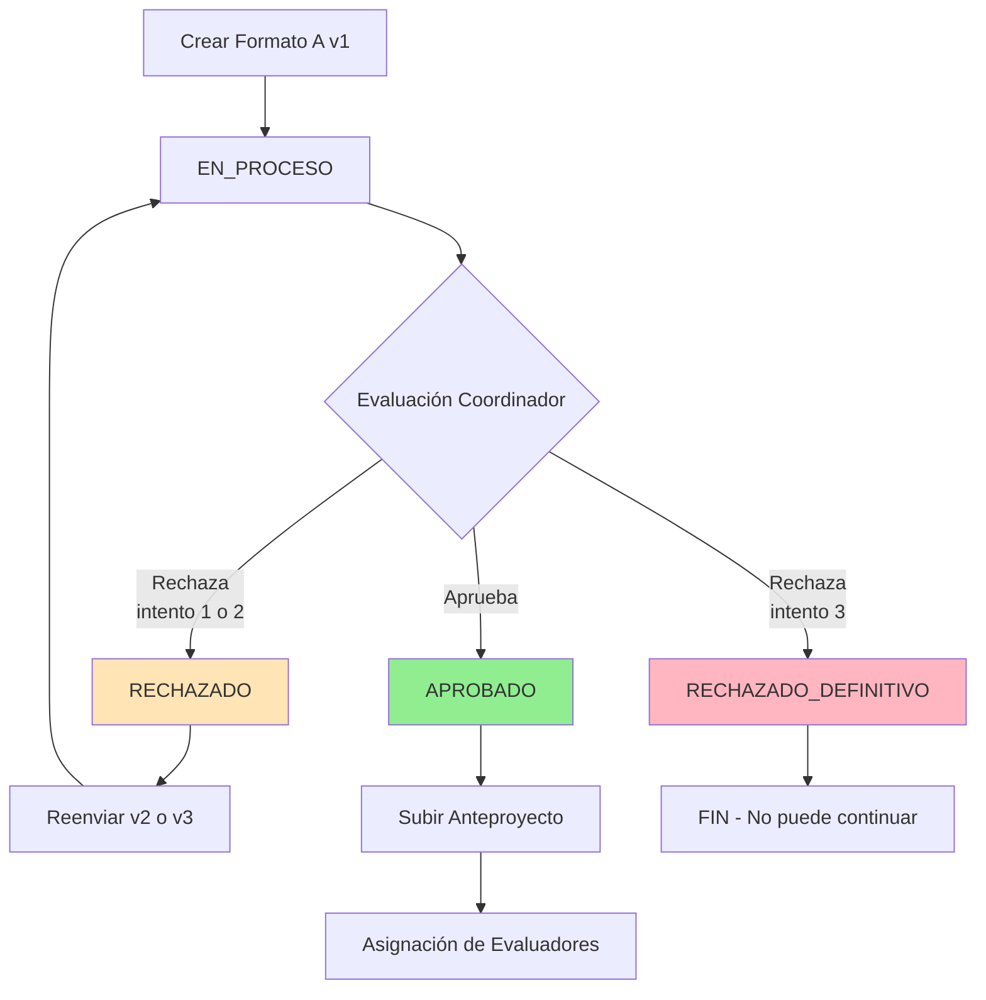

# 📦 Submission Service

Microservicio para la gestión de entregas de trabajos de grado (Formato A y Anteproyectos) en el sistema de Gestión de Trabajos de Grado de la Universidad del Cauca.

## 🎯 Responsabilidades del Microservicio

Este microservicio implementa los siguientes requisitos funcionales:

- **RF2**: Yo como docente necesito subir el formato A para comenzar el proceso de proyecto de grado
- **RF4**: Yo como docente necesito subir una nueva versión del formato A cuando hubo una evaluación de rechazado
- **RF6**: Yo como docente necesito subir el anteproyecto para continuar con el proceso de proyecto de grado
- **RF5 (Parcial)**: Proporciona información sobre el estado del proyecto para que estudiantes puedan consultarlo
- **RF7 (Parcial)**: Proporciona listado de anteproyectos para que el jefe de departamento los visualice

### Funcionalidades Principales

- ✅ Gestión de Formato A con hasta 3 intentos de envío
- ✅ Validación de carta de aceptación para modalidad de Práctica Profesional
- ✅ Gestión de anteproyectos vinculados a proyectos aprobados
- ✅ Almacenamiento seguro de archivos PDF
- ✅ Publicación de eventos asíncronos a RabbitMQ para notificaciones
- ✅ Control de estados del proyecto y documentos

## 🏗 Arquitectura del Dominio

### Entidades Principales

#### ProyectoGrado
Representa un proyecto de grado y su ciclo de vida completo.

**Atributos:**
- `id`: Integer - Identificador único del proyecto
- `titulo`: String - Título del proyecto (máx. 300 caracteres)
- `modalidad`: enumModalidad - INVESTIGACION o PRACTICA_PROFESIONAL
- `fechaCreacion`: LocalDateTime - Fecha de creación del proyecto
- `directorId`: Integer - ID del docente director (requerido)
- `codirectorId`: Integer - ID del docente codirector (opcional)
- `objetivoGeneral`: String (text) - Objetivo general del proyecto
- `objetivosEspecificos`: String (text) - Lista de objetivos específicos
- `estudiante1Id`: Integer - ID del estudiante principal (requerido)
- `estudiante2Id`: Integer - ID del segundo estudiante (opcional, solo para INVESTIGACION)
- `estado`: enumEstadoProyecto - Estado actual del proyecto
- `numeroIntentos`: Integer - Número de intentos de envío de Formato A (1-3)

#### FormatoA
Representa una versión específica del Formato A enviado.

**Atributos:**
- `id`: Long - Identificador único de la versión
- `proyectoId`: Long - Referencia al proyecto
- `version`: Integer - Número de versión (1, 2, o 3)
- `estado`: enumEstadoFormato - PENDIENTE, APROBADO, RECHAZADO
- `observaciones`: String - Comentarios del evaluador
- `nombreArchivo`: String - Nombre del archivo PDF
- `pdfUrl`: String - Ruta de almacenamiento del PDF
- `cartaUrl`: String - Ruta de la carta de aceptación (si aplica)
- `fechaEnvio`: LocalDateTime - Fecha y hora de envío

#### Anteproyecto
Representa el documento de anteproyecto final.

**Atributos:**
- `id`: Long - Identificador único
- `proyectoId`: Long - Referencia al proyecto
- `pdfUrl`: String - Ruta del documento PDF
- `fechaEnvio`: LocalDateTime - Fecha de envío
- `estado`: String - Estado del anteproyecto

### Enumeraciones

#### enumModalidad
Define las modalidades de proyecto permitidas según el reglamento.

```java
INVESTIGACION        // Hasta 2 estudiantes (Art. 9)
PRACTICA_PROFESIONAL // 1 estudiante, requiere carta de aceptación (Art. 29)
```

#### enumEstadoProyecto
Estados del ciclo de vida del proyecto.

```java
EN_PROCESO              // Proyecto creado, en evaluación
APROBADO                // Formato A aprobado, puede subir anteproyecto
RECHAZADO               // Rechazado, puede reenviar (intentos < 3)
RECHAZADO_DEFINITIVO    // 3 rechazos, proyecto finalizado
```

#### enumEstadoFormato
Estados de una versión de Formato A.

```java
PENDIENTE  // Enviado, esperando evaluación del coordinador
APROBADO   // Aprobado por el coordinador
RECHAZADO  // Rechazado con observaciones
```

## 🔐 Seguridad y Autenticación

### Flujo de Autenticación

Este microservicio **NO maneja autenticación directamente**. La autenticación se realiza en el **API Gateway** de la siguiente manera:

1. El usuario inicia sesión en el API Gateway (endpoint `/api/auth/login`)
2. El Gateway valida credenciales contra el **Identity Service**
3. El Gateway genera un **JWT (JSON Web Token)** 
4. El JWT se envía al cliente en la respuesta
5. El cliente incluye el JWT en el header `Authorization: Bearer {token}` en cada petición
6. El Gateway **valida el JWT** y extrae la información del usuario
7. El Gateway **propaga headers** al Submission Service con la información del usuario:
   - `X-User-Id`: ID del usuario autenticado
   - `X-User-Role`: Rol del usuario (DOCENTE, COORDINADOR, ESTUDIANTE, JEFE_DEPARTAMENTO)
   - `X-User-Email`: Email del usuario

### Headers Requeridos desde el Gateway

Todos los endpoints de este microservicio esperan recibir estos headers del Gateway:

| Header | Tipo | Descripción | Requerido |
|--------|------|-------------|-----------|
| `X-User-Id` | String | ID del usuario autenticado | ✅ Sí (para endpoints de creación) |
| `X-User-Role` | String | Rol del usuario | ✅ Sí (para validación de permisos) |
| `X-User-Email` | String | Email del usuario | ⚠️ Opcional |

### Headers para Comunicación entre Microservicios

Para endpoints que solo deben ser llamados por otros microservicios:

| Header | Valor | Descripción |
|--------|-------|-------------|
| `X-Service` | `review` | Identifica llamadas del Review Service |

### Validaciones de Autorización

El microservicio valida permisos usando la clase `SecurityRules`:

**Para Docentes (X-User-Role: DOCENTE):**
- ✅ Crear Formato A inicial
- ✅ Subir nueva versión de Formato A
- ✅ Subir anteproyecto (si es director del proyecto)

**Para Review Service (X-Service: review):**
- ✅ Cambiar estado de Formato A (aprobado/rechazado)
- ✅ Cambiar estado de anteproyecto

**Sin autenticación requerida:**
- ✅ Listar formatos A (lectura pública)
- ✅ Listar anteproyectos (lectura pública)
- ✅ Obtener detalles de un Formato A específico

## 📡 API Endpoints Detallados

### 1. Formato A - Crear Inicial (RF2)

**Endpoint:** `POST /api/submissions/formatoA`

**Descripción:** Permite a un docente crear el Formato A inicial de un proyecto de grado.

**Autenticación:** ✅ Requiere JWT del Gateway

**Headers Requeridos:**
```http
Content-Type: multipart/form-data
Authorization: Bearer {jwt_token}
X-User-Role: DOCENTE
X-User-Id: {userId}
```

**Request Body (multipart/form-data):**

**Parte 1: `data` (JSON - application/json)**
```json
{
  "titulo": "Sistema de gestión de inventarios usando IoT",
  "modalidad": "INVESTIGACION",
  "objetivoGeneral": "Desarrollar un sistema de gestión de inventarios utilizando tecnologías IoT",
  "objetivosEspecificos": [
    "Diseñar la arquitectura del sistema IoT",
    "Implementar sensores de detección de stock",
    "Desarrollar dashboard de monitoreo en tiempo real"
  ],
  "directorId": 101,
  "codirectorId": 205,
  "estudiante1Id": 1001,
  "estudiante2Id": 1002
}
```

**Validaciones del DTO `FormatoAData`:**
- `titulo`: String, obligatorio, no vacío, máximo 300 caracteres
- `modalidad`: Enum (INVESTIGACION | PRACTICA_PROFESIONAL), obligatorio
- `objetivoGeneral`: String, obligatorio, no vacío, máximo 1000 caracteres
- `objetivosEspecificos`: Array de strings, al menos 1 elemento, cada uno no vacío
- `directorId`: Integer, obligatorio
- `codirectorId`: Integer, opcional
- `estudiante1Id`: Integer, obligatorio
- `estudiante2Id`: Integer, opcional (solo permitido si modalidad es INVESTIGACION)

**Parte 2: `pdf` (File - application/pdf)**
- Archivo PDF del Formato A
- Tamaño máximo: 10MB

**Parte 3: `carta` (File - application/pdf) - CONDICIONAL**
- Carta de aceptación de la empresa
- **OBLIGATORIA** si modalidad = PRACTICA_PROFESIONAL
- **OPCIONAL** si modalidad = INVESTIGACION
- Tamaño máximo: 5MB

**Response:** `201 Created`
```json
{
  "id": 1
}
```

**Response DTO:** `IdResponse`
- `id`: Long - ID del proyecto creado

**Errores Posibles:**
- `403 Forbidden` - Usuario no es DOCENTE
- `400 Bad Request` - Validación de datos fallida
- `400 Bad Request` - Falta carta para PRACTICA_PROFESIONAL
- `500 Internal Server Error` - Error al guardar archivo

**Eventos Publicados:**
- Exchange: `formato-a-exchange`
- Routing Key: `formato-a.enviado`
- Payload: `{ proyectoId, version: 1, titulo }`

---

### 2. Formato A - Obtener por ID

**Endpoint:** `GET /api/submissions/formatoA/{id}`

**Descripción:** Obtiene los detalles de una versión específica de Formato A.

**Autenticación:** ❌ No requiere autenticación (lectura pública)

**Path Parameters:**
- `id`: Long - ID de la versión del Formato A

**Response:** `200 OK`
```json
{
  "id": 1,
  "proyectoId": 1,
  "version": 1,
  "estado": "PENDIENTE",
  "observaciones": null,
  "nombreArchivo": "formato_a_v1.pdf",
  "pdfUrl": "/app/uploads/formato-a/1/v1/documento.pdf",
  "cartaUrl": "/app/uploads/formato-a/1/v1/carta.pdf",
  "fechaEnvio": "2025-11-03T10:30:00"
}
```

**Response DTO:** `FormatoAView`
- `id`: Long
- `proyectoId`: Long
- `version`: Integer (1, 2, o 3)
- `estado`: String (PENDIENTE, APROBADO, RECHAZADO)
- `observaciones`: String (null si no ha sido evaluado)
- `nombreArchivo`: String
- `pdfUrl`: String
- `cartaUrl`: String (null si no aplica)
- `fechaEnvio`: String (ISO 8601 DateTime)

**Errores Posibles:**
- `404 Not Found` - ID no existe

---

### 3. Formato A - Listar con Filtros

**Endpoint:** `GET /api/submissions/formatoA`

**Descripción:** Lista los formatos A con paginación y filtrado opcional por docente.

**Autenticación:** ❌ No requiere autenticación (lectura pública)

**Query Parameters:**
- `docenteId`: String (opcional) - Filtra por ID del docente director
- `page`: Integer (opcional, default: 0) - Número de página
- `size`: Integer (opcional, default: 20) - Tamaño de página

**Ejemplo:**
```http
GET /api/submissions/formatoA?docenteId=101&page=0&size=10
```

**Response:** `200 OK`
```json
{
  "content": [
    {
      "id": 1,
      "proyectoId": 1,
      "version": 1,
      "estado": "PENDIENTE",
      "observaciones": null,
      "nombreArchivo": "formato_a_v1.pdf",
      "pdfUrl": "/app/uploads/formato-a/1/v1/documento.pdf",
      "cartaUrl": null,
      "fechaEnvio": "2025-11-03T10:30:00"
    },
    {
      "id": 5,
      "proyectoId": 3,
      "version": 2,
      "estado": "APROBADO",
      "observaciones": "Excelente propuesta",
      "nombreArchivo": "formato_a_v2.pdf",
      "pdfUrl": "/app/uploads/formato-a/3/v2/documento.pdf",
      "cartaUrl": null,
      "fechaEnvio": "2025-11-02T14:20:00"
    }
  ],
  "page": 0,
  "size": 10,
  "totalElements": 25
}
```

**Response DTO:** `FormatoAPage`
- `content`: Array de `FormatoAView`
- `page`: Integer - Número de página actual
- `size`: Integer - Tamaño de página
- `totalElements`: Long - Total de elementos

---

### 4. Formato A - Nueva Versión (RF4)

**Endpoint:** `POST /api/submissions/formatoA/{proyectoId}/nueva-version`

**Descripción:** Permite al docente subir una nueva versión del Formato A después de un rechazo.

**Autenticación:** ✅ Requiere JWT del Gateway

**Headers Requeridos:**
```http
Content-Type: multipart/form-data
Authorization: Bearer {jwt_token}
X-User-Role: DOCENTE
X-User-Id: {userId}
```

**Path Parameters:**
- `proyectoId`: Long - ID del proyecto

**Request Body (multipart/form-data):**

**Parte 1: `pdf` (File - application/pdf)**
- Nueva versión del documento PDF
- Tamaño máximo: 10MB

**Parte 2: `carta` (File - application/pdf) - CONDICIONAL**
- Nueva carta si el proyecto es PRACTICA_PROFESIONAL
- Tamaño máximo: 5MB

**Response:** `201 Created`
```json
{
  "id": 2
}
```

**Response DTO:** `IdResponse`
- `id`: Long - ID de la nueva versión creada

**Validaciones:**
- ✅ Usuario debe ser DOCENTE
- ✅ Proyecto debe existir
- ✅ Usuario debe ser el director del proyecto
- ✅ Estado del proyecto debe ser RECHAZADO
- ✅ Número de intentos debe ser < 3
- ✅ Si es tercer intento y se rechaza, proyecto pasa a RECHAZADO_DEFINITIVO

**Errores Posibles:**
- `403 Forbidden` - Usuario no es DOCENTE o no es el director
- `400 Bad Request` - Proyecto en estado inválido
- `400 Bad Request` - Ya se alcanzó el límite de 3 intentos
- `404 Not Found` - Proyecto no existe

**Eventos Publicados:**
- Exchange: `formato-a-exchange`
- Routing Key: `formato-a.reenviado`
- Payload: `{ proyectoId, version, titulo }`

---

### 5. Formato A - Cambiar Estado (RF3)

**Endpoint:** `PATCH /api/submissions/formatoA/{versionId}/estado`

**Descripción:** Permite al Review Service (coordinador) cambiar el estado de una versión de Formato A.

**Autenticación:** ⚠️ Requiere header de servicio interno

**Headers Requeridos:**
```http
Content-Type: application/json
X-Service: review
```

**Path Parameters:**
- `versionId`: Long - ID de la versión del Formato A

**Request Body:**
```json
{
  "estado": "APROBADO",
  "observaciones": "La propuesta cumple con todos los requisitos. Se aprueba para continuar con el anteproyecto.",
  "evaluadoPor": 50
}
```

**Request DTO:** `EvaluacionRequest`
- `estado`: Enum (APROBADO | RECHAZADO), obligatorio
- `observaciones`: String, opcional, máximo 2000 caracteres
- `evaluadoPor`: Integer, obligatorio - ID del coordinador

**Response:** `200 OK`
Sin contenido en el body.

**Efectos:**
- Si `estado = APROBADO`: Proyecto pasa a estado APROBADO
- Si `estado = RECHAZADO` y intentos < 3: Proyecto pasa a RECHAZADO
- Si `estado = RECHAZADO` y intentos = 3: Proyecto pasa a RECHAZADO_DEFINITIVO

**Validaciones:**
- ✅ Header `X-Service` debe ser "review"
- ✅ Versión debe existir
- ✅ Estado debe ser válido (APROBADO o RECHAZADO)

**Errores Posibles:**
- `403 Forbidden` - Header X-Service inválido
- `404 Not Found` - Versión no existe
- `400 Bad Request` - Estado inválido

**Eventos Publicados (si es rechazo definitivo):**
- Exchange: `proyecto-exchange`
- Routing Key: `proyecto.rechazado-definitivamente`
- Payload: `{ proyectoId, titulo }`

---

### 6. Anteproyecto - Crear (RF6)

**Endpoint:** `POST /api/submissions/anteproyecto`

**Descripción:** Permite al docente director subir el anteproyecto una vez aprobado el Formato A.

**Autenticación:** ✅ Requiere JWT del Gateway

**Headers Requeridos:**
```http
Content-Type: multipart/form-data
Authorization: Bearer {jwt_token}
X-User-Role: DOCENTE
X-User-Id: {userId}
```

**Request Body (multipart/form-data):**

**Parte 1: `data` (JSON - application/json)**
```json
{
  "proyectoId": 1
}
```

**Request DTO:** `AnteproyectoData`
- `proyectoId`: Long, obligatorio

**Parte 2: `pdf` (File - application/pdf)**
- Documento del anteproyecto
- Tamaño máximo: 15MB

**Response:** `201 Created`
```json
{
  "id": 1
}
```

**Response DTO:** `IdResponse`
- `id`: Long - ID del anteproyecto creado

**Validaciones:**
- ✅ Usuario debe ser DOCENTE
- ✅ Usuario debe ser el director del proyecto
- ✅ Proyecto debe existir
- ✅ Formato A del proyecto debe estar APROBADO
- ✅ No debe existir un anteproyecto previo para el proyecto

**Errores Posibles:**
- `403 Forbidden` - Usuario no es DOCENTE o no es el director
- `400 Bad Request` - Formato A no está aprobado
- `400 Bad Request` - Ya existe un anteproyecto para este proyecto
- `404 Not Found` - Proyecto no existe

**Eventos Publicados:**
- Exchange: `anteproyecto-exchange`
- Routing Key: `anteproyecto.enviado`
- Payload: `{ proyectoId, titulo, directorId, estudiantesIds }`

---

### 7. Anteproyecto - Listar (RF7)

**Endpoint:** `GET /api/submissions/anteproyecto`

**Descripción:** Lista los anteproyectos con paginación (para jefe de departamento).

**Autenticación:** ❌ No requiere autenticación (lectura pública)

**Query Parameters:**
- `page`: Integer (opcional, default: 0) - Número de página
- `size`: Integer (opcional, default: 20) - Tamaño de página

**Ejemplo:**
```http
GET /api/submissions/anteproyecto?page=0&size=10
```

**Response:** `200 OK`
```json
{
  "content": [
    {
      "id": 1,
      "proyectoId": 1,
      "pdfUrl": "/app/uploads/anteproyectos/1/documento.pdf",
      "fechaEnvio": "2025-11-03T15:45:00",
      "estado": "PENDIENTE"
    },
    {
      "id": 2,
      "proyectoId": 3,
      "pdfUrl": "/app/uploads/anteproyectos/3/documento.pdf",
      "fechaEnvio": "2025-11-02T09:20:00",
      "estado": "EN_EVALUACION"
    }
  ],
  "page": 0,
  "size": 10,
  "totalElements": 15
}
```

**Response DTO:** `AnteproyectoPage`
- `content`: Array de `AnteproyectoView`
  - `id`: Long
  - `proyectoId`: Long
  - `pdfUrl`: String
  - `fechaEnvio`: String (ISO 8601 DateTime)
  - `estado`: String
- `page`: Integer
- `size`: Integer
- `totalElements`: Long

---

### 8. Anteproyecto - Cambiar Estado

**Endpoint:** `PATCH /api/submissions/anteproyecto/{id}/estado`

**Descripción:** Permite al Review Service cambiar el estado de un anteproyecto.

**Autenticación:** ⚠️ Requiere header de servicio interno

**Headers Requeridos:**
```http
Content-Type: application/json
X-Service: review
```

**Path Parameters:**
- `id`: Long - ID del anteproyecto

**Request Body:**
```json
{
  "estado": "APROBADO",
  "observaciones": "El anteproyecto cumple con todos los requisitos metodológicos y técnicos."
}
```

**Request DTO:** `CambioEstadoAnteproyectoRequest`
- `estado`: String, obligatorio
- `observaciones`: String, opcional, máximo 2000 caracteres

**Response:** `200 OK`
Sin contenido en el body.

**Validaciones:**
- ✅ Header `X-Service` debe ser "review"
- ✅ Anteproyecto debe existir

**Errores Posibles:**
- `403 Forbidden` - Header X-Service inválido
- `404 Not Found` - Anteproyecto no existe

---

## 📋 DTOs (Data Transfer Objects)

Este microservicio utiliza DTOs para estructurar la transferencia de datos entre el cliente y el servidor, aplicando validaciones en la capa de API y desacoplando la representación externa de los modelos de dominio internos.

### Patrones y Convenciones

#### Tipos de DTOs

El servicio utiliza tres categorías principales de DTOs:

1. **Request DTOs** (Entrada)
   - Contienen validaciones de entrada usando Jakarta Validation
   - Se utilizan en operaciones POST, PUT, PATCH
   - Ejemplo: `FormatoAData`, `AnteproyectoData`, `EvaluacionRequest`

2. **Response DTOs** (Salida)
   - Representan datos de salida sin validaciones
   - Se utilizan en operaciones GET
   - Ejemplo: `FormatoAView`, `AnteproyectoView`, `IdResponse`

3. **Container DTOs** (Contenedores)
   - Envuelven colecciones de datos para paginación
   - Ejemplo: `FormatoAPage`, `AnteproyectoPage`

#### Validaciones Aplicadas

Todos los DTOs de entrada utilizan anotaciones de Jakarta Validation para garantizar la integridad de datos:

| Anotación | Propósito | Ejemplo de uso |
|-----------|-----------|----------------|
| `@NotNull` | Campo obligatorio (no puede ser null) | `@NotNull private Integer directorId;` |
| `@NotBlank` | String obligatorio y no vacío | `@NotBlank private String titulo;` |
| `@NotEmpty` | Colección obligatoria con al menos un elemento | `@NotEmpty private List<String> objetivos;` |
| `@Size` | Limita longitud de strings o tamaño de colecciones | `@Size(max=300) private String titulo;` |
| `@Pattern` | Valida formato usando expresión regular | `@Pattern(regexp="APROBADO\|RECHAZADO")` |
| `@Valid` | Valida objetos anidados recursivamente | `@Valid @RequestBody FormatoAData data` |

### DTOs de Request (Entrada)

#### FormatoAData

**Propósito:** Datos JSON para crear el Formato A inicial (RF2).

**Uso:** `POST /api/submissions/formatoA` (multipart/form-data - parte `data`)

**Estructura:**

```json
{
  "titulo": "Sistema de Gestión de Inventarios con IoT",
  "modalidad": "INVESTIGACION",
  "objetivoGeneral": "Desarrollar un sistema de gestión de inventarios utilizando tecnologías IoT",
  "objetivosEspecificos": [
    "Diseñar la arquitectura del sistema IoT",
    "Implementar sensores de detección de stock",
    "Desarrollar dashboard de monitoreo en tiempo real"
  ],
  "directorId": 101,
  "codirectorId": 205,
  "estudiante1Id": 1001,
  "estudiante2Id": 1002
}
```

**Validaciones:**

| Campo | Validación | Descripción |
|-------|------------|-------------|
| `titulo` | `@NotBlank`, `@Size(max=300)` | Título del trabajo, obligatorio, máximo 300 caracteres |
| `modalidad` | `@NotNull` | INVESTIGACION o PRACTICA_PROFESIONAL, obligatorio |
| `objetivoGeneral` | `@NotBlank`, `@Size(max=1000)` | Objetivo general, obligatorio, máximo 1000 caracteres |
| `objetivosEspecificos` | `@NotEmpty`, cada elemento `@NotBlank` | Lista de objetivos, al menos 1 requerido |
| `directorId` | `@NotNull` | ID del director, obligatorio |
| `codirectorId` | Opcional | ID del codirector, puede ser null |
| `estudiante1Id` | `@NotNull` | ID del estudiante principal, obligatorio |
| `estudiante2Id` | Opcional | ID del segundo estudiante (solo INVESTIGACION) |

**Reglas de Negocio:**

- Si `modalidad = PRACTICA_PROFESIONAL`: requiere archivo `carta` en el multipart
- Si `modalidad = INVESTIGACION`: permite hasta 2 estudiantes
- El archivo `pdf` es siempre obligatorio en el multipart

---

#### AnteproyectoData

**Propósito:** Datos JSON para subir el anteproyecto (RF6).

**Uso:** `POST /api/submissions/anteproyecto` (multipart/form-data - parte `data`)

**Estructura:**

```json
{
  "proyectoId": 1
}
```

**Validaciones:**

| Campo | Validación | Descripción |
|-------|------------|-------------|
| `proyectoId` | `@NotNull` | ID del proyecto asociado, obligatorio |

**Pre-condiciones Validadas en el Servicio:**

- El proyecto debe existir
- El usuario debe ser el director del proyecto
- El Formato A del proyecto debe estar APROBADO
- No debe existir un anteproyecto previo

---

#### EvaluacionRequest

**Propósito:** Cambiar estado de una versión de Formato A (APROBADO/RECHAZADO).

**Uso:** `PATCH /api/submissions/formatoA/{versionId}/estado` (solo Review Service)

**Estructura:**

```json
{
  "estado": "APROBADO",
  "observaciones": "Cumple con todos los requisitos metodológicos",
  "evaluadoPor": 5
}
```

**Validaciones:**

| Campo | Validación | Descripción |
|-------|------------|-------------|
| `estado` | `@NotNull`, `@Pattern(regexp="APROBADO\|RECHAZADO")` | Estado de evaluación, solo APROBADO o RECHAZADO |
| `observaciones` | `@Size(max=2000)` | Comentarios del evaluador, opcional, máximo 2000 caracteres |
| `evaluadoPor` | `@NotNull` | ID del coordinador que evalúa, obligatorio |

**Seguridad:** Requiere header `X-Service: review` para invocación interna.

---

#### CambioEstadoAnteproyectoRequest

**Propósito:** Cambiar estado de un anteproyecto.

**Uso:** `PATCH /api/submissions/anteproyecto/{id}/estado` (solo Review Service)

**Estructura:**

```json
{
  "estado": "APROBADO",
  "observaciones": "Anteproyecto bien estructurado con metodología clara"
}
```

**Validaciones:**

| Campo | Validación | Descripción |
|-------|------------|-------------|
| `estado` | `@NotBlank` | Estado del anteproyecto, obligatorio |
| `observaciones` | `@Size(max=2000)` | Observaciones sobre la evaluación, opcional |

**Seguridad:** Requiere header `X-Service: review`.

---

#### CreateSubmissionDTO

**Propósito:** Crear un nuevo proyecto submission (endpoint legacy).

**Uso:** `POST /api/submissions` (alternativa al flujo de Formato A)

**Estructura:**

```json
{
  "titulo": "Sistema de IA para análisis educativo",
  "descripcion": "Desarrollo de un sistema de inteligencia artificial para análisis de datos educativos",
  "modalidad": "INVESTIGACION",
  "docenteDirectorId": 101,
  "docenteCodirectorId": 102,
  "estudianteId": 1001,
  "objetivoGeneral": "Desarrollar un sistema de IA para mejorar el análisis de datos educativos",
  "objetivosEspecificos": "1. Diseñar arquitectura\n2. Implementar modelos\n3. Validar resultados",
  "rutaFormatoA": "/uploads/formato-a.pdf",
  "rutaCarta": "/uploads/carta.pdf"
}
```

**Validaciones:**

| Campo | Validación | Descripción |
|-------|------------|-------------|
| `titulo` | `@NotBlank`, `@Size(max=300)` | Título del proyecto, obligatorio |
| `descripcion` | `@Size(max=1000)` | Descripción general, opcional |
| `modalidad` | `@NotNull` | Modalidad del trabajo, obligatorio |
| `docenteDirectorId` | `@NotNull` | ID del director, obligatorio |
| `objetivoGeneral` | `@Size(max=1000)` | Objetivo general, opcional |
| `objetivosEspecificos` | `@Size(max=2000)` | Objetivos específicos, opcional |

---

#### EvaluacionDTO

**Propósito:** Evaluación simplificada del coordinador (RF-3).

**Uso:** `PUT /api/submissions/{id}/evaluar`

**Estructura:**

```json
{
  "aprobado": true,
  "comentarios": "El proyecto cumple con todos los requisitos"
}
```

**Validaciones:**

| Campo | Validación | Descripción |
|-------|------------|-------------|
| `aprobado` | `@NotNull` | true=aprobar, false=rechazar, obligatorio |
| `comentarios` | `@Size(max=2000)` | Comentarios del evaluador, opcional |

---

### DTOs de Response (Salida)

#### FormatoAView

**Propósito:** Vista completa de una versión de Formato A.

**Uso:** `GET /api/submissions/formatoA/{id}`, contenido de `FormatoAPage`

**Estructura:**

```json
{
  "id": 1,
  "proyectoId": 1,
  "titulo": "Sistema de Gestión de Inventarios con IoT",
  "version": 1,
  "estado": "PENDIENTE",
  "observaciones": null,
  "nombreArchivo": "formato_a_v1.pdf",
  "pdfUrl": "/app/uploads/formato-a/1/v1/documento.pdf",
  "cartaUrl": "/app/uploads/formato-a/1/v1/carta.pdf",
  "fechaEnvio": "2025-11-03T10:30:00",
  "docenteDirectorNombre": "Dr. Juan Pérez",
  "docenteDirectorEmail": "juan.perez@unicauca.edu.co",
  "estudiantesEmails": ["estudiante1@unicauca.edu.co", "estudiante2@unicauca.edu.co"]
}
```

**Campos:**

| Campo | Tipo | Descripción |
|-------|------|-------------|
| `id` | Long | Identificador único de la versión |
| `proyectoId` | Long | ID del proyecto asociado |
| `titulo` | String | Título del trabajo de grado |
| `version` | Integer | Número de versión (1, 2, o 3) |
| `estado` | enumEstadoFormato | PENDIENTE, APROBADO, RECHAZADO |
| `observaciones` | String | Comentarios del evaluador (null si no evaluado) |
| `nombreArchivo` | String | Nombre del archivo PDF |
| `pdfUrl` | String | Ruta del PDF del Formato A |
| `cartaUrl` | String | Ruta de la carta (null si no aplica) |
| `fechaEnvio` | LocalDateTime | Fecha y hora de envío |
| `docenteDirectorNombre` | String | Nombre completo del director |
| `docenteDirectorEmail` | String | Email del director |
| `estudiantesEmails` | List<String> | Lista de emails de estudiantes |

---

#### AnteproyectoView

**Propósito:** Vista de un anteproyecto con datos básicos.

**Uso:** `GET /api/submissions/anteproyecto`, contenido de `AnteproyectoPage`

**Estructura:**

```json
{
  "id": 1,
  "proyectoId": 1,
  "pdfUrl": "/app/uploads/anteproyectos/1/documento.pdf",
  "fechaEnvio": "2025-11-03T15:45:00",
  "estado": "EN_EVALUACION"
}
```

**Campos:**

| Campo | Tipo | Descripción |
|-------|------|-------------|
| `id` | Long | Identificador único del anteproyecto |
| `proyectoId` | Long | ID del proyecto asociado |
| `pdfUrl` | String | Ruta del PDF del anteproyecto |
| `fechaEnvio` | LocalDateTime | Fecha y hora de envío |
| `estado` | String | Estado actual (PENDIENTE, EN_EVALUACION, APROBADO, RECHAZADO) |

---

#### SubmissionResponseDTO

**Propósito:** Información completa de un proyecto submission.

**Uso:** `GET /api/submissions/{id}`, `GET /api/submissions`

**Estructura:**

```json
{
  "id": 1,
  "titulo": "Sistema de Gestión de Inventarios con IoT",
  "descripcion": "Desarrollo de un sistema IoT para gestión automatizada de inventarios",
  "modalidad": "INVESTIGACION",
  "fechaCreacion": "2025-11-01T10:00:00",
  "fechaUltimaModificacion": "2025-11-03T15:30:00",
  "docenteDirectorId": 101,
  "docenteCodirectorId": 102,
  "estudianteId": 1001,
  "objetivoGeneral": "Desarrollar un sistema de gestión de inventarios con IoT",
  "objetivosEspecificos": "1. Diseñar arquitectura\n2. Implementar sensores\n3. Desarrollar dashboard",
  "estadoActual": "EN_EVALUACION_COORDINADOR",
  "numeroIntentos": 1,
  "comentariosComite": null,
  "esEstadoFinal": false,
  "rutaFormatoA": "/uploads/formato-a.pdf",
  "rutaCarta": "/uploads/carta.pdf"
}
```

**Campos:**

| Campo | Tipo | Descripción |
|-------|------|-------------|
| `id` | Long | Identificador único del proyecto |
| `titulo` | String | Título del trabajo de grado |
| `descripcion` | String | Descripción general |
| `modalidad` | enumModalidad | INVESTIGACION o PRACTICA_PROFESIONAL |
| `fechaCreacion` | LocalDateTime | Fecha de creación |
| `fechaUltimaModificacion` | LocalDateTime | Última modificación |
| `docenteDirectorId` | Long | ID del director |
| `docenteCodirectorId` | Long | ID del codirector (opcional) |
| `estudianteId` | Long | ID del estudiante |
| `objetivoGeneral` | String | Objetivo general |
| `objetivosEspecificos` | String | Objetivos específicos |
| `estadoActual` | String | Estado actual del proyecto |
| `numeroIntentos` | Integer | Número de intentos de Formato A (0-3) |
| `comentariosComite` | String | Comentarios del comité |
| `esEstadoFinal` | boolean | true si es un estado terminal |
| `rutaFormatoA` | String | Ruta del Formato A |
| `rutaCarta` | String | Ruta de la carta |

---

#### IdResponse

**Propósito:** Respuesta simple con ID del recurso creado.

**Uso:** Respuesta de operaciones POST exitosas

**Estructura:**

```json
{
  "id": 1
}
```

**Campos:**

| Campo | Tipo | Descripción |
|-------|------|-------------|
| `id` | Long | ID del recurso creado |

---

### DTOs Contenedores (Paginación)

#### FormatoAPage

**Propósito:** Respuesta paginada de versiones de Formato A.

**Uso:** `GET /api/submissions/formatoA`

**Estructura:**

```json
{
  "content": [
    {
      "id": 1,
      "proyectoId": 1,
      "titulo": "Sistema de IoT...",
      "version": 1,
      "estado": "PENDIENTE",
      ...
    }
  ],
  "page": 0,
  "size": 20,
  "totalElements": 100
}
```

**Campos:**

| Campo | Tipo | Descripción |
|-------|------|-------------|
| `content` | List<FormatoAView> | Lista de elementos en la página actual |
| `page` | int | Número de página actual (inicia en 0) |
| `size` | int | Tamaño de la página |
| `totalElements` | long | Total de elementos en todas las páginas |

---

#### AnteproyectoPage

**Propósito:** Respuesta paginada de anteproyectos.

**Uso:** `GET /api/submissions/anteproyecto`

**Estructura:**

```json
{
  "content": [
    {
      "id": 1,
      "proyectoId": 1,
      "pdfUrl": "/app/uploads/anteproyectos/1/documento.pdf",
      "fechaEnvio": "2025-11-03T15:45:00",
      "estado": "EN_EVALUACION"
    }
  ],
  "page": 0,
  "size": 20,
  "totalElements": 50
}
```

**Campos:**

| Campo | Tipo | Descripción |
|-------|------|-------------|
| `content` | List<AnteproyectoView> | Lista de anteproyectos en la página actual |
| `page` | int | Número de página actual (inicia en 0) |
| `size` | int | Tamaño de la página |
| `totalElements` | long | Total de anteproyectos |

---

### Mejores Prácticas para Uso de DTOs

#### 1. Validación en el Cliente

Antes de enviar una petición, valide los datos en el cliente para mejorar la experiencia de usuario:

```javascript
// Ejemplo en JavaScript
function validarFormatoA(data) {
  if (!data.titulo || data.titulo.length > 300) {
    throw new Error("Título inválido");
  }
  if (!data.modalidad || !["INVESTIGACION", "PRACTICA_PROFESIONAL"].includes(data.modalidad)) {
    throw new Error("Modalidad inválida");
  }
  if (!data.objetivosEspecificos || data.objetivosEspecificos.length === 0) {
    throw new Error("Debe proporcionar al menos un objetivo específico");
  }
  // ... más validaciones
}
```

#### 2. Manejo de Errores de Validación

El servidor retorna errores de validación con código 400 y estructura:

```json
{
  "error": "Bad Request",
  "message": "El título es obligatorio",
  "timestamp": "2025-11-03T10:30:00",
  "path": "/api/submissions/formatoA"
}
```

#### 3. Multipart Form Data

Para endpoints que requieren archivos:

```bash
curl -X POST http://localhost:8082/api/submissions/formatoA \
  -H "X-User-Role: DOCENTE" \
  -H "X-User-Id: 101" \
  -F 'data={"titulo":"Mi Proyecto","modalidad":"INVESTIGACION",...};type=application/json' \
  -F "pdf=@formato_a.pdf;type=application/pdf" \
  -F "carta=@carta.pdf;type=application/pdf"
```

#### 4. Paginación

Para listar recursos con paginación:

```bash
# Primera página (0-19)
GET /api/submissions/formatoA?page=0&size=20

# Segunda página (20-39)
GET /api/submissions/formatoA?page=1&size=20

# Con filtro por docente
GET /api/submissions/formatoA?docenteId=101&page=0&size=10
```

#### 5. OpenAPI/Swagger

Todos los DTOs están documentados con anotaciones `@Schema` de OpenAPI. 
Accede a la documentación interactiva en:

```
http://localhost:8082/swagger-ui.html
```

---

## 🐰 Eventos RabbitMQ

### Eventos Publicados por Submission Service

El servicio publica eventos para que otros microservicios (principalmente Notification Service) puedan reaccionar.

| Exchange | Routing Key | Cuándo se publica | Payload |
|----------|-------------|-------------------|---------|
| `formato-a-exchange` | `formato-a.enviado` | Se crea Formato A v1 (RF2) | `{ "proyectoId": 1, "version": 1, "titulo": "...", "directorId": 101, "estudiantesIds": [1001, 1002], "coordinadorEmail": "coordinador@unicauca.edu.co" }` |
| `formato-a-exchange` | `formato-a.reenviado` | Se envía nueva versión (RF4) | `{ "proyectoId": 1, "version": 2, "titulo": "...", "directorId": 101, "estudiantesIds": [1001], "coordinadorEmail": "coordinador@unicauca.edu.co" }` |
| `anteproyecto-exchange` | `anteproyecto.enviado` | Se sube anteproyecto (RF6) | `{ "proyectoId": 1, "titulo": "...", "directorId": 101, "estudiantesIds": [1001], "jefeDepartamentoEmail": "jefe.departamento@unicauca.edu.co" }` |
| `proyecto-exchange` | `proyecto.rechazado-definitivamente` | Formato A rechazado 3 veces | `{ "proyectoId": 1, "titulo": "...", "directorId": 101, "estudiantesIds": [1001] }` |

### Configuración de RabbitMQ

Los exchanges y queues se crean automáticamente mediante la configuración en `RabbitConfig.java`:

```yaml
Exchanges:
  - formato-a-exchange (type: topic)
  - anteproyecto-exchange (type: topic)
  - proyecto-exchange (type: topic)

Queues (para este servicio):
  - Ninguna (este servicio solo publica, no consume)
```

---

## 💾 Almacenamiento de Archivos

### Estructura de Directorios

```
/app/uploads/
├── formato-a/
│   ├── {proyectoId}/
│   │   ├── v1/
│   │   │   ├── documento.pdf
│   │   │   └── carta.pdf (si PRACTICA_PROFESIONAL)
│   │   ├── v2/
│   │   │   ├── documento.pdf
│   │   │   └── carta.pdf (si aplica)
│   │   └── v3/
│   │       ├── documento.pdf
│   │       └── carta.pdf (si aplica)
│   └── ...
└── anteproyectos/
    ├── {proyectoId}/
    │   └── documento.pdf
    └── ...
```

### Límites de Tamaño

Configurados en `application.yml`:

```yaml
spring:
  servlet:
    multipart:
      max-file-size: 15MB      # Tamaño máximo por archivo
      max-request-size: 20MB   # Tamaño máximo total de la petición
```

**Límites por Tipo:**
- Formato A PDF: 10MB máximo (recomendado)
- Carta de aceptación: 5MB máximo (recomendado)
- Anteproyecto PDF: 15MB máximo

### Permisos Requeridos

El directorio `/app/uploads` debe tener permisos de escritura para el usuario que ejecuta la aplicación:

```bash
chmod -R 755 /app/uploads
chown -R app-user:app-group /app/uploads
```

---

## 📚 Reglas de Negocio Implementadas

### 1. Control de Intentos de Formato A

- ✅ Máximo 3 intentos para enviar Formato A
- ✅ Después del 3er rechazo, proyecto pasa a RECHAZADO_DEFINITIVO
- ✅ No se permiten más envíos después del rechazo definitivo

### 2. Validación de Modalidades

#### INVESTIGACION
- ✅ Permite hasta 2 estudiantes
- ✅ Carta de aceptación es opcional
- ✅ Puede tener codirector (opcional)

#### PRACTICA_PROFESIONAL
- ✅ Permite solo 1 estudiante
- ✅ Carta de aceptación es OBLIGATORIA
- ✅ Puede tener codirector (opcional)

### 3. Flujo de Aprobación

```
1. Docente crea Formato A v1 → Estado: EN_PROCESO
2. Coordinador evalúa:
   a. Si APRUEBA → Estado: APROBADO (puede subir anteproyecto)
   b. Si RECHAZA y intentos < 3 → Estado: RECHAZADO (puede reenviar)
   c. Si RECHAZA y intentos = 3 → Estado: RECHAZADO_DEFINITIVO (fin)
3. Si APROBADO, docente puede subir anteproyecto
4. Jefe de departamento asigna evaluadores (en otro servicio)
```

### 4. Restricciones de Anteproyecto

- ✅ Solo se puede subir si Formato A está APROBADO
- ✅ Solo el director del proyecto puede subirlo
- ✅ Solo se permite 1 anteproyecto por proyecto
- ✅ No se puede eliminar ni reemplazar (implementación actual)

### 5. Notificaciones Automáticas

- ✅ Al enviar Formato A v1 → Notifica al coordinador
- ✅ Al reenviar Formato A → Notifica al coordinador
- ✅ Al subir anteproyecto → Notifica al jefe de departamento
- ✅ Al aprobar/rechazar → Notifica a director y estudiantes (vía Review Service)

---

## 🔄 Flujo de Estados del Proyecto



**Leyenda:**
- 🟢 Verde: Estado exitoso (APROBADO)
- 🔴 Rojo: Estado final negativo (RECHAZADO_DEFINITIVO)
- 🟡 Amarillo: Estado temporal (RECHAZADO, puede recuperarse)

---

## 🚀 Despliegue y Configuración

### Prerequisitos

- ✅ Docker Desktop instalado
- ✅ Java 21+ (para desarrollo local sin Docker)
- ✅ Maven 3.9+
- ✅ PostgreSQL 15+ (si no usa Docker)
- ✅ RabbitMQ 3.12+ (si no usa Docker)

### Opción 1: Con Docker Compose (Recomendado)

```bash
# 1. Clonar el repositorio
cd submission-service

# 2. Construir la imagen
docker-compose build

# 3. Iniciar todos los servicios
docker-compose up -d

# 4. Ver logs en tiempo real
docker-compose logs -f submission-service

# 5. Verificar estado
docker-compose ps

# 6. Detener servicios
docker-compose down

# 7. Detener y eliminar volúmenes (limpieza completa)
docker-compose down -v
```

### Opción 2: Desarrollo Local sin Docker

```bash
# 1. Iniciar PostgreSQL con Docker
docker run -d \
  --name submission-postgres \
  -p 5432:5432 \
  -e POSTGRES_DB=submissiondb \
  -e POSTGRES_USER=submission_user \
  -e POSTGRES_PASSWORD=submission_pass \
  postgres:15-alpine

# 2. Iniciar RabbitMQ con Docker
docker run -d \
  --name submission-rabbitmq \
  -p 5672:5672 \
  -p 15672:15672 \
  -e RABBITMQ_DEFAULT_USER=admin \
  -e RABBITMQ_DEFAULT_PASS=admin_password \
  rabbitmq:3.12-management-alpine

# 3. Crear directorio de uploads
mkdir -p /app/uploads
chmod 755 /app/uploads

# 4. Compilar el proyecto
mvn clean install

# 5. Ejecutar la aplicación
mvn spring-boot:run

# O ejecutar el JAR directamente
java -jar target/submission-service-0.0.1-SNAPSHOT.jar
```

### Opción 3: Compilar JAR para Producción

```bash
# Compilar sin ejecutar tests
mvn clean package -DskipTests

# El JAR se genera en:
# target/submission-service-0.0.1-SNAPSHOT.jar

# Ejecutar con perfil de producción
java -jar target/submission-service-0.0.1-SNAPSHOT.jar \
  --spring.profiles.active=prod
```

---

## 🔧 Variables de Entorno

### Variables de Base de Datos

| Variable | Descripción | Default | Requerido |
|----------|-------------|---------|-----------|
| `DATABASE_HOST` | Host de PostgreSQL | `submission-postgres` | ✅ |
| `DATABASE_PORT` | Puerto de PostgreSQL | `5432` | ✅ |
| `DATABASE_NAME` | Nombre de la base de datos | `submissiondb` | ✅ |
| `DATABASE_USERNAME` | Usuario de la base de datos | `submission_user` | ✅ |
| `DATABASE_PASSWORD` | Contraseña de la base de datos | `submission_pass` | ✅ |

### Variables de RabbitMQ

| Variable | Descripción | Default | Requerido |
|----------|-------------|---------|-----------|
| `RABBITMQ_HOST` | Host de RabbitMQ | `rabbitmq` | ✅ |
| `RABBITMQ_PORT` | Puerto de RabbitMQ | `5672` | ✅ |
| `RABBITMQ_USERNAME` | Usuario de RabbitMQ | `admin` | ✅ |
| `RABBITMQ_PASSWORD` | Contraseña de RabbitMQ | `admin_password` | ✅ |

### Variables de Almacenamiento

| Variable | Descripción | Default | Requerido |
|----------|-------------|---------|-----------|
| `FILE_STORAGE_PATH` | Ruta para guardar archivos PDF | `/app/uploads` | ✅ |

### Variables de Integración

| Variable | Descripción | Default | Requerido |
|----------|-------------|---------|-----------|
| `IDENTITY_SERVICE_URL` | URL del Identity Service | `http://identity:8081` | ⚠️ |
| `SERVICE_INTERNAL_TOKEN` | Token para comunicación interna | `default-token-only-for-dev` | ⚠️ |
| `COORDINADOR_EMAIL` | Email del coordinador (temporal) | `coordinador@unicauca.edu.co` | ⚠️ |
| `JEFE_DEPARTAMENTO_EMAIL` | Email del jefe (temporal) | `jefe.departamento@unicauca.edu.co` | ⚠️ |

### Variables de Spring

| Variable | Descripción | Default | Requerido |
|----------|-------------|---------|-----------|
| `SPRING_PROFILES_ACTIVE` | Perfil activo (dev, prod) | `dev` | ❌ |
| `SERVER_PORT` | Puerto del servidor | `8082` | ❌ |

### Ejemplo de archivo `.env`

```env
# Database
DATABASE_HOST=localhost
DATABASE_PORT=5432
DATABASE_NAME=submissiondb
DATABASE_USERNAME=submission_user
DATABASE_PASSWORD=my_secure_password

# RabbitMQ
RABBITMQ_HOST=localhost
RABBITMQ_PORT=5672
RABBITMQ_USERNAME=admin
RABBITMQ_PASSWORD=admin_password

# Storage
FILE_STORAGE_PATH=/var/app/uploads

# Integration
IDENTITY_SERVICE_URL=http://identity-service:8081
COORDINADOR_EMAIL=coordinador@unicauca.edu.co
JEFE_DEPARTAMENTO_EMAIL=jefe.departamento@unicauca.edu.co

# Spring
SPRING_PROFILES_ACTIVE=prod
SERVER_PORT=8082
```

---

## 🧪 Testing

### Ejecutar Tests

```bash
# Tests unitarios
mvn test

# Tests de integración
mvn verify

# Tests con reporte de cobertura
mvn clean verify jacoco:report

# Solo compilar sin tests
mvn clean package -DskipTests
```

### Tests de Integración

El proyecto usa **Testcontainers** para tests de integración con PostgreSQL y RabbitMQ reales:

```java
@SpringBootTest
@Testcontainers
class SubmissionIntegrationTest {
    @Container
    static PostgreSQLContainer<?> postgres = new PostgreSQLContainer<>("postgres:15-alpine");
    
    @Container
    static RabbitMQContainer rabbitmq = new RabbitMQContainer("rabbitmq:3.12-management-alpine");
}
```

### Tests Manuales con cURL

#### 1. Crear Formato A (RF2)

```bash
curl -X POST http://localhost:8082/api/submissions/formatoA \
  -H "X-User-Role: DOCENTE" \
  -H "X-User-Id: 101" \
  -F 'data={"titulo":"Sistema IoT","modalidad":"INVESTIGACION","objetivoGeneral":"Desarrollar sistema IoT","objetivosEspecificos":["Objetivo 1","Objetivo 2"],"directorId":101,"estudiante1Id":1001};type=application/json' \
  -F "pdf=@formato_a.pdf" \
  -F "carta=@carta.pdf"
```

#### 2. Listar Formatos A

```bash
curl -X GET "http://localhost:8082/api/submissions/formatoA?page=0&size=10"
```

#### 3. Nueva Versión (RF4)

```bash
curl -X POST http://localhost:8082/api/submissions/formatoA/1/nueva-version \
  -H "X-User-Role: DOCENTE" \
  -H "X-User-Id: 101" \
  -F "pdf=@formato_a_v2.pdf"
```

#### 4. Cambiar Estado (RF3)

```bash
curl -X PATCH http://localhost:8082/api/submissions/formatoA/1/estado \
  -H "Content-Type: application/json" \
  -H "X-Service: review" \
  -d '{
    "estado": "APROBADO",
    "observaciones": "Aprobado para continuar",
    "evaluadoPor": 50
  }'
```

#### 5. Subir Anteproyecto (RF6)

```bash
curl -X POST http://localhost:8082/api/submissions/anteproyecto \
  -H "X-User-Role: DOCENTE" \
  -H "X-User-Id: 101" \
  -F 'data={"proyectoId":1};type=application/json' \
  -F "pdf=@anteproyecto.pdf"
```

---

## 📊 Monitoring y Observabilidad

### Health Check

Verifica el estado del servicio y sus dependencias:

```bash
curl http://localhost:8082/actuator/health
```

**Respuesta:**
```json
{
  "status": "UP",
  "components": {
    "db": {
      "status": "UP",
      "details": {
        "database": "PostgreSQL",
        "validationQuery": "isValid()"
      }
    },
    "diskSpace": {
      "status": "UP",
      "details": {
        "total": 500000000000,
        "free": 250000000000,
        "threshold": 10485760
      }
    },
    "ping": {
      "status": "UP"
    },
    "rabbit": {
      "status": "UP",
      "details": {
        "version": "3.12.0"
      }
    }
  }
}
```

### Metrics

```bash
# Ver todas las métricas disponibles
curl http://localhost:8082/actuator/metrics

# Métrica específica de JVM
curl http://localhost:8082/actuator/metrics/jvm.memory.used

# Métrica de HTTP requests
curl http://localhost:8082/actuator/metrics/http.server.requests
```

### RabbitMQ Management UI

Acceder a la consola de administración de RabbitMQ:

```
URL: http://localhost:15672
Usuario: admin (o guest si es instalación local)
Contraseña: admin_password (o guest)
```

Aquí puedes ver:
- ✅ Exchanges creados
- ✅ Queues activas
- ✅ Mensajes publicados/consumidos
- ✅ Conexiones activas

### Logs

El servicio usa **Logback** para logging estructurado:

```bash
# Ver logs en tiempo real (Docker)
docker-compose logs -f submission-service

# Ver solo errores
docker-compose logs -f submission-service | grep ERROR

# Ver logs de archivo (si se configuró)
tail -f /var/log/submission-service/application.log
```

**Niveles de log configurados:**
- `root`: INFO
- `co.unicauca.comunicacionmicroservicios`: DEBUG
- `org.springframework.amqp`: INFO
- `org.hibernate.SQL`: DEBUG

---

## 🐛 Troubleshooting

### Error: "Solo DOCENTE puede realizar esta acción"

**Causa:** El header `X-User-Role` no está presente o no es "DOCENTE"

**Solución:**
```bash
# Asegurarse de incluir el header correcto
-H "X-User-Role: DOCENTE"
```

### Error: "Carta de aceptación obligatoria"

**Causa:** Modalidad es PRACTICA_PROFESIONAL pero no se envió el archivo `carta`

**Solución:**
```bash
# Incluir la carta en el multipart
-F "carta=@carta_aceptacion.pdf"
```

### Error: "Proyecto en estado inválido para reenvío"

**Causa:** Intentando reenviar cuando el proyecto no está en estado RECHAZADO

**Solución:**
- Verificar que el Formato A fue rechazado
- No se puede reenviar si ya fue aprobado
- No se puede reenviar si está en RECHAZADO_DEFINITIVO

### Error: "No se pudo guardar el archivo"

**Causas posibles:**
1. Permisos insuficientes en `/app/uploads`
2. Disco lleno
3. Ruta no existe

**Soluciones:**
```bash
# Crear directorio con permisos
mkdir -p /app/uploads
chmod 755 /app/uploads

# Verificar espacio en disco
df -h

# Verificar permisos
ls -la /app/uploads
```

### Error: "Connection refused" al conectar con RabbitMQ

**Causas:**
1. RabbitMQ no está corriendo
2. Puerto incorrecto
3. Credenciales incorrectas

**Soluciones:**
```bash
# Verificar que RabbitMQ está corriendo
docker ps | grep rabbitmq

# Reiniciar RabbitMQ
docker-compose restart rabbitmq

# Verificar logs de RabbitMQ
docker-compose logs rabbitmq

# Verificar variables de entorno
echo $RABBITMQ_HOST
echo $RABBITMQ_PORT
```

### Error: "Cannot create connection to database"

**Causas:**
1. PostgreSQL no está corriendo
2. Credenciales incorrectas
3. Base de datos no existe

**Soluciones:**
```bash
# Verificar PostgreSQL
docker ps | grep postgres

# Conectarse manualmente para verificar
docker exec -it submission-postgres psql -U submission_user -d submissiondb

# Ver logs de PostgreSQL
docker-compose logs submission-postgres

# Recrear base de datos
docker-compose down -v
docker-compose up -d
```

### Error: "File too large"

**Causa:** Archivo excede el límite de 15MB

**Solución:**
- Comprimir el PDF antes de subir
- O modificar límite en `application.yml`:
```yaml
spring:
  servlet:
    multipart:
      max-file-size: 20MB
      max-request-size: 25MB
```

### Error: "Maximum number of attempts reached"

**Causa:** Ya se enviaron 3 versiones del Formato A

**Solución:**
- No hay solución técnica, es una regla de negocio
- El proyecto está en RECHAZADO_DEFINITIVO
- El estudiante debe iniciar un nuevo proyecto

---

## 📞 Información del Proyecto

**Institución:** Universidad del Cauca  
**Facultad:** Ingeniería Electrónica y Telecomunicaciones  
**Programa:** Ingeniería de Sistemas  
**Proyecto:** Sistema de Gestión de Trabajos de Grado  
**Versión:** 1.0.0  
**Fecha:** Noviembre 2025  

### Arquitectura de Microservicios

Este servicio es parte de una arquitectura más amplia:

- **API Gateway**: Enrutamiento y autenticación JWT
- **Identity Service**: Gestión de usuarios y autenticación
- **Submission Service**: Gestión de Formato A y Anteproyectos (ESTE SERVICIO)
- **Review Service**: Evaluaciones y asignación de evaluadores
- **Notification Service**: Envío de correos electrónicos
- **PostgreSQL**: Base de datos relacional
- **RabbitMQ**: Mensajería asíncrona

### Tecnologías Utilizadas

- ☕ Java 21
- 🍃 Spring Boot 3.x
- 🗄️ PostgreSQL 15
- 🐰 RabbitMQ 3.12
- 🐳 Docker & Docker Compose
- 📦 Maven 3.9+
- 🧪 JUnit 5 + Testcontainers

### Contacto y Soporte

Para preguntas, problemas o sugerencias:
- **Email**: soporte-sistemas@unicauca.edu.co
- **Repositorio**: [GitHub - Submission Service]
- **Documentación adicional**: Ver carpeta `/docs` en el repositorio

---

## 📄 Licencia

Este proyecto es de uso interno de la Universidad del Cauca.  
Todos los derechos reservados © 2025

